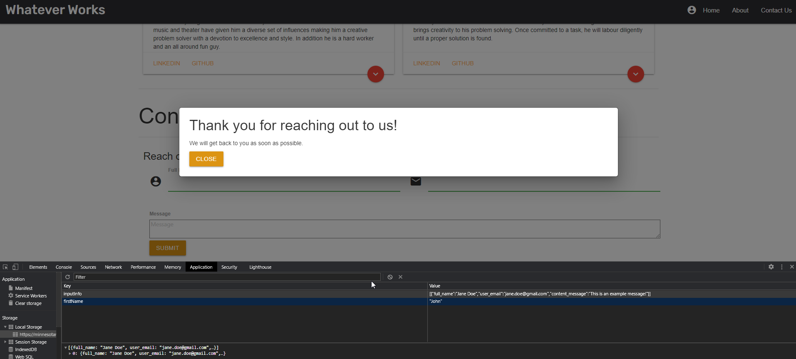

# PM Beta Form Builder

This is where the user will be taken to when they click the link to the deployed page

They will be presented with a data entry from with built in validation

The footer contains a dynamically generated HTML block where the name is pulled from local storage

The user will be presented with this contact info page by using the navigation bar or footer menu options

Through the use of modals and local storage, we created the framework to ingest messages from our end users

## Purpose
A form builder enabling dynamic and configurable data documentation

### Table of Contents
- [Website](#website)
- [Presentation](#presentation)
- [Built With](#built-with)
- [Resources](#resources)
- [Contribution](#contribution)
- [Features](#features)
- [Future Enhancements](#future-enhancements)

---
## Website & Presentation
- https://minnesotanyst.github.io/pm-beta/

[Back to Contents](#table-of-contents)

---
## Presentation
- https://prezi.com/view/hIQmrJRV8sTyjGOSF9Fx/

[Back to Contents](#table-of-contents)

---
## Built With
- CSS
- HTML
- Javascript
- [JQuery](https://jquery.com/)
- [Bootstrap](https://getbootstrap.com/)
- [Materialize](https://materializecss.com/)

[Back to Contents](#table-of-contents)

---
## Resources
- [<form.io>](https://www.form.io/)
- [CountAPI](https://countapi.xyz/)

[Back to Contents](#table-of-contents)

---
## Features
- Integrated two APIs

[Back to Contents](#table-of-contents)

---

## Future Enhancements

[Back to Contents](#table-of-contents)

## Contribution
- [Anthony Potts](https://github.com/anthonypotts)
- [Jake Nystrom](https://github.com/minnesotaNyst)
- [Nathan Potts]()
- [Will Pearson](https://github.com/willp429)

[Back to Contents](#table-of-contents)
