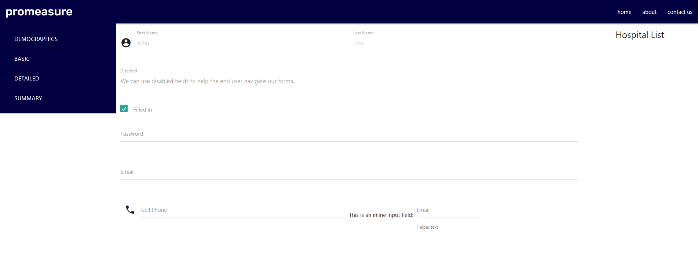

# PM Beta Form Builder

- Insert GIF post HTML cleanup

## Purpose
A form builder enabling dynamic and configurable data documentation

### Table of Contents
- [Website](#website)
- [Built With](#built-with)
- [Resources](#resources)
- [Contribution](#contribution)
- [Features](#features)
- [Future Enhancements](#future-enhancements)

---
## Website
- https://minnesotanyst.github.io/pm-beta/

[Back to Contents](#table-of-contents)

---
## Built With
- CSS
- HTML
- Javascript
- [JQuery](https://jquery.com/) (https://cdnjs.cloudflare.com/ajax/libs/jquery/3.5.1/jquery.min.js)
- [Bootstrap](https://getbootstrap.com/) (https://cdn.jsdelivr.net/npm/bootstrap@4.5.3/dist/css/bootstrap.min.css)
- [Materialize](https://materializecss.com/)(https://cdnjs.cloudflare.com/ajax/libs/materialize/1.0.0/css/materialize.min.css)

[Back to Contents](#table-of-contents)

---
## Resources
- [<form.io>](https://www.form.io/)
- [CountAPI](https://countapi.xyz/)

[Back to Contents](#table-of-contents)

---
## Features
- Integrated two APIs

[Back to Contents](#table-of-contents)

---

## Future Enhancements
(https://github.com/minnesotaNyst/pm-beta/issues)

[Back to Contents](#table-of-contents)

## Contribution
- **Anthony Potts**
- **Jake Nystrom**
- **Nathan Potts**
- **Will Pearson**

[Back to Contents](#table-of-contents)